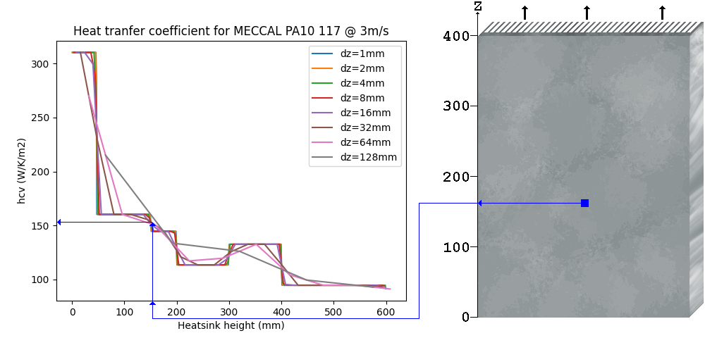

# HEATSINK THERMAL IMAGING PREDICTION

This project allows the calculation of the temperature distribution in heatsinks. Thermal finite element analysis is performed using python libraries.

The following figure shows the thermal distribution on a heatsink with 2 heat sources located in the central area. The airflow follows the direction of the arrow.

The heatsink is divided in multiple elements and the temperature is calculated in loop. After a few iterations, the temperatures converge in the range of 64ºC (lower corners) and 94ºC (upper corners).

## Table of contents

1. [SPECIFICATION](#SPECIFICATION)
2. [HEAT TRANSFER ALGEBRA](#HEAT-TRANSFER-ALGEBRA)
3. [RESULTS](#RESULTS)

## SPECIFICATION

### Boundary conditions

Heatsink dimensions have to be specified for simulation:
* The baseplate width Y, perpendicular of the direction of the airflow.
* The baseplate height Z, parallel to the direction of the aiflow.
* The baseplate thickness must be specified for thermal conduction.

### Heat Sources layout

For all power sources, define
* Unique designator
* Position (Y,Z in mm)
* Dimensions (W,H in mm)
* Power generated(in W)
* Thermal resistance from junction to exposed pad (in K/W)

## HEAT TRANSFER ALGEBRA

The heatsink is subsequently divided in rectangles. The simulation ends when a loop exceeds a specific time.
| PARTITION | 0 | 1 | 2 | 3 | 4 | 5 | 6 | 7 | ... |
|-----------|---|---|---|---|---|---|---|---|-----|
| ELEMENTS  | 4 | 8 | 16| 32| 64|128|256|512| ... |

### Partition loops @ level 1

Each element is assigned a temperature.

$$ T_{element}= \theta + T_{ambient}$$

The starting temperature increase is taken from the heatsink datasheet. Typical values of $ \theta $:
* 70ºK for natural convection
* 50ºK for forced convection

On resizing, the temperature of each element is kept.

$$ T_{element}-T_{ambient}= \theta = \begin{pmatrix}
\theta_{y=0,z=0} & \dots & \theta_{y=Y,z=0} \\
\vdots & \ddots & \vdots \\
\theta_{y=0,z=Z} & \dots & \theta_{y=Y,z=Z}
\end{pmatrix} $$

The power generation matrix is calculated for each element. Intersection of heat sources (s) with each element is multiplied by the heat density q.

$$
\dot Q(y,z) = \sum_{\forall s} q_s \cdot \left( \begin{pmatrix}
y=0,z=0 & \dots & y=Y,z=0 \\
\vdots & \ddots & \vdots \\
y=0,z=Z & \dots & y=Y,z=Z
\end{pmatrix} \cap (Y,Z,W,H)_s \right)
$$

Both the radiation and the convection admittance are calculated for each element base on the vertical position. Emissivity of 0.9 is used for the radiation.

Conduction for adjacent elements is calculated using the contact length * baseplate thickness / distance between centers of elements.
* Horizontal conduction
  * The contact length is the cell height dz
  * The distance between centers is the cell width dy
* Vertical conduction
  * The contact length is the cell width dy
  * The distance between centers is the cell height dz

### Differential convection

Datasheets provide the thermal resistance ($ R_{th} $ in K/W) for a specific width y and different heights z. The heat transfer coefficient hcv (W/m2/K) is obtained from deriving the datasheet curve.

$$ h_{cv}(z) = {{1 \over \Delta y} {\partial {1 \over R_{th}(z)} \over {\partial z}}} $$

The convection heat transfer coefficient of each element depends only on the vertical coordinate z.

The element admittance (W/K) is obtained by multiplying the heat transfer coefficient by the horizontal and vertical dimensions of the element.

$$ R_{th,cv}(z) = h_{cv}(z) \times {\Delta y} \times {\Delta z} $$

### Thermal loops @ level 2

Temperatures, convection, radiation, and power generation matrices are flattened. The elemnt 0 represents the ambient.

| ELEMENT | RELATIVE COORDINATES (y,z) |
|---|---|
| 1 | 0,0 |
| 2 | 1,0 |
|...| ... |
| M | Y,Z |

In the following figure M=16.

The convection and radiation coefficients are located in the diagonal.

$$ \left[ R_{th,cv+r}^{-1}  \right] =  \begin{pmatrix}
R_{th}^{-1}(1\rightarrow 0) & 0 & \dots & 0 \\
0 & R_{th}^{-1}(2 \rightarrow 0 ) & \dots & 0 \\
\vdots & \vdots & \ddots  & \vdots \\
0  & 0 & \dots & R_{th}^{-1}(M \rightarrow 0)
\end{pmatrix}$$

The conduction matrix is added, considering all permutations of adjacent conduction within the boundary limits.

$$ \left[ R_{th,k}^{-1}  \right] =  \begin{pmatrix}
\sum_i R_{th}^{-1}(1 \leftrightarrow i) & -R_{th}^{-1}(1 \leftrightarrow 2) & \dots & -R_{th}^{-1}(1 \leftrightarrow M) \\
-R_{th}^{-1}(1 \leftrightarrow 2) & \sum_i R_{th}^{-1}(2 \leftrightarrow i) & \dots & -R_{th}^{-1}(2 \leftrightarrow M) \\
\vdots & \vdots & \ddots  & \vdots \\
-R_{th}^{-1}(1 \leftrightarrow M) & \dots & 0  & \sum_i R_{th}^{-1}(M \leftrightarrow i)
\end{pmatrix} $$

Finally, the temperature is calculated by inverting the M matrix and multiplying (scalar dot product) it by the flattened heat sources.

$$ T_{element} = \Theta + T_{ambient}$$

$$ \Theta = \begin{pmatrix}
\theta_{1} \\
\theta_{2} \\
\vdots \\
\theta_{M}\\
\end{pmatrix} = \left[ R_{th,cv+r}^{-1}+R_{th,k}^{-1}  \right]^{-1} \cdot  \begin{pmatrix}
\dot Q_{1} \\
\dot Q_{2} \\
\vdots \\
\dot Q_{M}\\
\end{pmatrix}$$

## RESULTS

### Experimental data

The simulation calculates the local temperature of each position of the heatsink. The standard temperature palette mapping goes trough multiple colours for better contrast. The palette goes down to the ambient temperature to allow comparison with experimental results obtained from thermal imaging.

### Software alternatives

Comparison with an alternative simulation software shows similar results.

